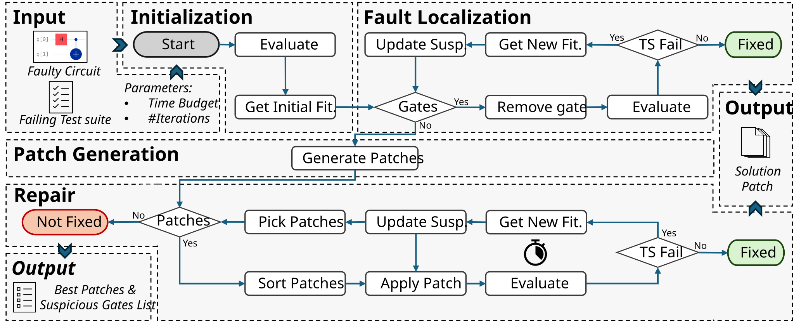

# Qrep

Qrep is an automated quantum circuit repair and fault localisation approach that iteratively identifies and corrects faulty gates by applying candidate patches across the circuit and assigning a suspiciousness score to each gate, reflecting its likelihood of being faulty. Guided by these scores, Qrep focuses on the most suspicious gates in subsequent iterations, narrowing the search space and improving repair efficiency. Qrep was evaluated on 40 faulty circuits, achieving a repair success rate of 70%. For circuits that were not fully repaired, the actual faulty gate was ranked among the top 44% most suspicious gates, demonstrating its effectiveness in fault localisation.

### Main Steps

1-Fault Localisation – Computes gate-level suspiciousness scores to identify likely faulty gates.

2-Patch Generation – Generates candidate gate-based modifications to correct faults.

3-Repair – Applies patches iteratively, focusing on the most suspicious gates to efficiently repair the circuit.

---

## Repository Structure

The repository is organised as follows:

### Code Files

- **`main.py`** – Implements our automatic quantum program repair approach.  
- **`main_random_search.py`** – Implements a random search baseline.  
- **`circuit_execution.py`** – Provides shared circuit execution functions.  
- **`patch_generation.py`** – Generates candidate patches for repair.  
- **`execute_experiment.py`** – Runs the full set of experiments.  
- **`python_to_qasm.py`** – Converts Python-based quantum programs to QASM.  
- **`qulacs_to_qasm.py`** – Converts Qulacs circuits to QASM.  
- **`mutants_union_selection.py`** – Selects mutants for repair experiments.  
- **`check_results.ipynb`** – Notebook for analyzing experimental results.

---

### `data/`

Contains **all data required for experiments**, including:

- **Oracles**: Specifications used to verify program correctness.  
- **Original Programs**: Correct quantum programs.  
- **Mutants**: Mutated program versions used to simulate faults.  
- **Faulty Programs**: Programs containing real faults.  

All experimental inputs needed for reproducing the results are included here.

---

### `results/`

Contains results from the experiments, including outputs for the **two baselines**:

- Best patches for each experiment
- Gate suspiciousness list after each execution

---

